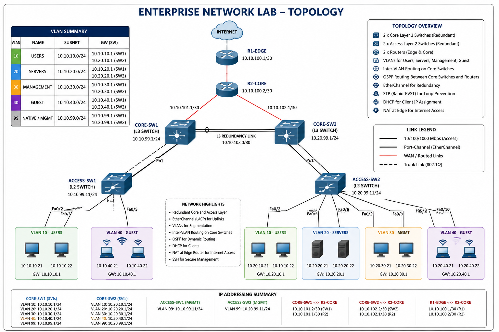

# Enterprise Network Lab

A practical Cisco enterprise networking lab demonstrating enterprise LAN/WAN design, VLAN segmentation, inter-VLAN routing, STP, EtherChannel, OSPF, DHCP, SSH, ACLs, troubleshooting, and network verification.

## Project Overview

This project simulates a small enterprise network environment using Cisco Packet Tracer.

The lab demonstrates:

- Enterprise network topology design
- VLAN segmentation
- 802.1Q trunking
- Inter-VLAN routing
- Rapid-PVST / STP
- EtherChannel using LACP
- OSPF dynamic routing
- DHCP services
- SSH device management
- Extended ACL security
- End-to-end connectivity testing
- Network troubleshooting and verification

## Network Architecture

The topology consists of:

- R1-EDGE
- R2-CORE
- CORE-SW1
- CORE-SW2
- ACCESS-SW1
- ACCESS-SW2
- User PCs
- Server
- Guest endpoint

## VLAN Design

| VLAN ID | Name | Network | Gateway |
|---|---|---|---|
| 10 | USERS | 10.10.10.0/24 | 10.10.10.1 |
| 20 | SERVERS | 10.10.20.0/24 | 10.10.20.1 |
| 30 | MANAGEMENT | 10.10.30.0/24 | 10.10.30.1 |
| 40 | GUEST | 10.10.40.0/24 | 10.10.40.1 |
| 99 | NATIVE | Management / Native VLAN | — |

## Routing

OSPF is used as the dynamic routing protocol between the core network and upstream router.

The core switches advertise their connected VLAN networks through OSPF.

OSPF adjacency was verified using:
show ip ospf neighbor
Switching
VLANs

VLANs 10, 20, 30, 40, and 99 are configured across the switching infrastructure.

802.1Q Trunking

802.1Q trunking is configured on the Port-channel uplinks.

Allowed VLANs:

10,20,30,40,99

Native VLAN:

99
EtherChannel

LACP EtherChannel is used to provide redundancy and increased bandwidth.

Configured Port-channels:

CORE-SW1 — Po1
CORE-SW2 — Po2
ACCESS-SW1 — Po1
ACCESS-SW2 — Po2

Verification:

show etherchannel summary
Spanning Tree

Rapid-PVST / STP is enabled to prevent Layer 2 switching loops.

The core switches act as STP root bridges for their respective VLANs.

Verification:

show spanning-tree vlan 10
show spanning-tree vlan 20
show spanning-tree vlan 30
show spanning-tree vlan 40
DHCP

DHCP was configured to provide IP addresses to end devices.

DHCP bindings were verified on the core switches using:

show ip dhcp binding
Network Security

An extended ACL named GUEST-RESTRICT is configured to restrict guest network access.

The guest VLAN is prevented from accessing internal user, server, management, and remote internal networks.

ACL verification:

show access-lists
SSH Management

SSH version 2 is enabled on the network devices for secure remote management.

Verification:

show ip ssh

Expected result:

SSH Enabled - version 2.0
Verification

The following features have been verified:

Feature	Status
VLANs	✅ Verified
802.1Q Trunking	✅ Verified
EtherChannel / LACP	✅ Verified
STP	✅ Verified
Inter-VLAN Routing	✅ Verified
OSPF	✅ Verified
DHCP	✅ Verified
SSH v2	✅ Verified
ACL	✅ Verified
End-to-End Connectivity	✅ Verified
Repository Structure
enterprise-network-lab/
│
├── configs/
│   ├── ACCESS-SW1.txt
│   ├── ACCESS-SW2.txt
│   ├── CORE-SW1.txt
│   └── CORE-SW2.txt
│
├── diagrams/
│   ├── README.md
│   └── enterprise-network-topology.png
│
├── documentation/
│   ├── README.md
│   ├── ip-addressing-plan.md
│   ├── network-design.md
│   ├── network-requirements.md
│   ├── network-security.md
│   ├── network-services.md
│   ├── project-summary.md
│   ├── routing.md
│   ├── switching.md
│   ├── troubleshooting.md
│   ├── verification-and-testing.md
│   └── vlan-design.md
│
├── labs/
│   ├── ACCESS-SW1.txt
│   ├── ACCESS-SW2.txt
│   ├── CORE-SW1.txt
│   ├── CORE-SW2.txt
│   ├── R1-EDGE.txt
│   └── enterprise-network-lab.pkt
│
├── topology/
│
├── verification/
│   ├── README.md
│   └── verification-summary.md
│
├── LICENSE
└── README.md

Key Technologies
Cisco IOS
Cisco Packet Tracer
VLAN
STP / Rapid-PVST
EtherChannel
LACP
OSPF
DHCP
SSH
IPv4 ACL
Inter-VLAN Routing
Network Troubleshooting
Skills Demonstrated

This project demonstrates practical skills in:

Enterprise LAN/WAN networking
Cisco switching
Layer 3 switching
Routing and switching troubleshooting
VLAN segmentation
Network security
Dynamic routing
Network management
Connectivity verification
Cisco IOS configuration
Lab Platform

Cisco Packet Tracer

Project Status

Completed

The lab configuration, connectivity testing, security controls, troubleshooting activities, and verification activities have been implemented and documented.
